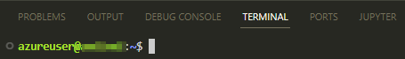

# Inception – A Practical Guide for Running a Python Project Inside a Docker Dev Container Inside an Azure ML VM Connected with Local VS Code


This drawing was created with the lovely [app.diagrams.net](https://app.diagrams.net/)
<br></br>

&nbsp;&nbsp;&nbsp; ***Inception** refers to Christopher Nolan's 2010 film of the same name and its concept of nested dreams, which suits nicely as an analogy for the nested virtualization described in this article.* 
<br></br>

Collaborating on data science projects is exciting and is the best way to come up with brand new and creative ideas if it wasn't for the one problem that disrupts the party. Besides ensuring the general reproduce-ability of data science experiments, the biggest challenge is ensuring the reproduce-ability of the Python code across a team and platforms. In data science, it is common to rely on various open-source packages like ``NumPy``, ``pandas``, ``TensorFlow``, ``PyTorch``, et cetera. All of these packages come in different release versions. Therefore it is good practice for Python code sharing to add requirements as a reconstruction guide for the Python environments. The responsibility to set up the environment correctly is consequently on the side of the contributor (developer, data scientist, data analyst, etc.). Unfortunately, this procedure yields a high potential for error yet raises the entry barrier for contributors. It is more than reasonable to argue that the barrier to entry should be as low as possible.  

The motivation behind this brief article is to give a practical guide for overcoming the reproduce-ability challenge to lower the entry barrier for project contributors. Furthermore, to raise awareness of the ***Inception*** (nested virtualization) solution with **Microsoft Azure**. Of course, there are equivalent solutions like **Docker Desktop** with **WSL2**, **GitHub Codespaces**, or **JetBrains Space**. The benefit of using Azure is the out-of-the-box integration with other services.

All credits go to the open-source contributors who made this solution possible, especially those developers that work on **Visual Studio (VS) Code** & **Docker**. I am just sharing what is possible through their stunning work.
<br></br>

# Prerequisites
* **Azure Machine Learning (AML)** workspace
* **Visual Studio (VS) Code** (version ≥ [1.63](https://code.visualstudio.com/updates/v1_63#_remote-development)) with the *Remote Development* extension  
  * Note: Version 1.63 added the ability to work in a container on an SSH server
<br></br>

# Guide
The following section describes the most relevant steps for SSH connecting to an AML VM, cloning a GitHub repository, and opening a pre-set-up dev container out of that cloned repo.
## 1&nbsp; Create AML VM (Compute Instance)
* Enable SSH access in *Advanced Settings* when creating a compute instance and generate a new key pair
* The key will be automatically downloaded as a ``.pem`` file

## 2&nbsp; SSH Connect to AML VM
*  Adapt the following string or use the string creator provided in the Azure Portal:  
``ssh -i <private key path> azureuser@XX.XX.XXX.XXX -p 50000``  
For ```<private key path>``` enter the absolute path to the downloaded .pem file, e. g.: ``C:/XXX/YYY/ZZZ/linkedin_demo.pem``
* Open VS Code and enter this string as a new SSH target in the *Remote Explorer* extension
* Connect to the host and verify the connection either by opening a new   terminal:  
    
  or by the connection indication provided by VS Code in the bottom-left corner of the status bar:  
    


## 3&nbsp; Clone Repository from GitHub on the VM
VS Code makes it easy to create a dev container. Additional information is shared here [[source]](https://code.visualstudio.com/docs/remote/remote-overview). However, this demo especially shall emphasize how easy it is to rebuild someone else's project. For that reason, a [demo repo](https://github.com/NotAndex/azure_ml_inception) is provided conveniently for cloning.
* Open the following folder (*File* → *Open Folder*) ``/home/azureuser/localfiles``
* Enter ``git clone https://github.com/NotAndex/azure_ml_inception.git`` in the terminal
* Open the cloned repo  (*File* → *Open Folder*) ``/home/azureuser/localfiles/azure_ml_inception``  
  


## 4&nbsp; Connect to Dev Container
* Press (*F1*) and run ```>Remote-Containers: Rebuild and Reopen in Container``` in the VS Code Command Palette
* Again, verify the connection to the container with the status bar indication of VS Code:  
  
* Run the Python script
<br></br>

# Further Notes
* The dev container can easily mount shared & blob storage (Azure services)
* It is possible to push to GitHub from within the dev container
* The repository can be installed as a Python package in editable mode if all the config files are in place. Just add ``"postCreateCommand": "pip install -e ."`` to the ``devcontainer.json``
<br></br>

# Closing Words
Some might think, after all these words: Why was the elephant in the room not addressed? Did Leonardo DiCaprio already deserve an Oscar for his role in [Inception](https://www.imdb.com/title/tt1375666/)? I'm afraid I have to disappoint. This controversy is written on a different page.